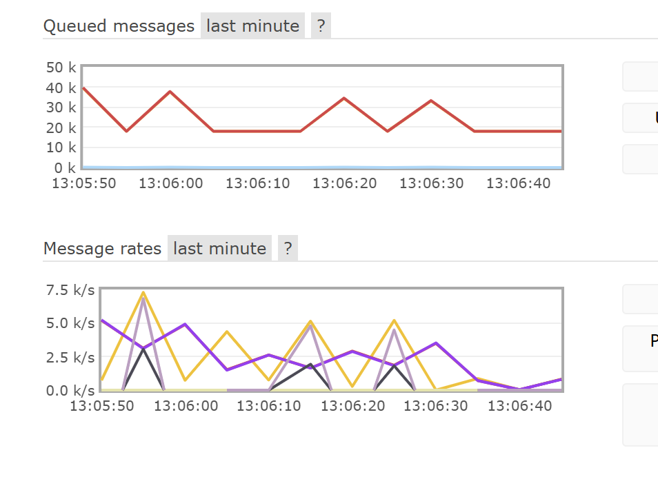

# Отчет: Сравнение производительности RabbitMQ и Redis

## Цель эксперимента
Сравнение пропускной способности, задержек и стабильности брокеров сообщений RabbitMQ и Redis в различных условиях нагрузки (размер сообщения и интенсивность потока).

---

## Результаты тестирования (Прогон 1)
Данные из [results.csv](file:///c:/p/ucheba/broker/labs/task2/results.csv)

| Брокер | Размер (B) | Цель (msg/s) | Отправлено | Получено | Потери (%) | Ср. задержка (ms) | p95 (ms) | Throughput (msg/s) |
| :--- | :--- | :--- | :--- | :--- | :--- | :--- | :--- | :--- |
| **Redis** | 128 | 10000 | 2368 | 2368 | 0.0% | 10.44 | 42.25 | 473.6 |
| **Redis** | 128 | 50000 | 3800 | 3800 | 0.0% | 1.62 | 5.15 | 760.0 |
| **Redis** | 1024 | 100000 | 7073 | 7073 | 0.0% | 4.04 | 6.46 | 1414.6 |
| **Redis** | 10240 | 100000 | 4753 | 4753 | 0.0% | 1.21 | 1.99 | 950.6 |
| **Redis** | 102400 | 100000 | 2547 | 2547 | 0.0% | 55.28 | 96.75 | 509.4 |
| **RabbitMQ** | 128 | 100000 | 39337 | 39337 | 0.0% | 6.04 | 13.90 | 7867.4 |
| **RabbitMQ** | 1024 | 100000 | 35655 | 35655 | 0.0% | 796.15 | 1123.03 | 7131.0 |
| **RabbitMQ** | 10240 | 100000 | 26895 | 20844 | 22.5% | 2474.92 | 3407.06 | 4168.8 |
| **RabbitMQ** | 102400 | 100000 | 4604 | 4604 | 0.0% | 22.22 | 35.94 | 920.8 |

---

## Результаты тестирования (Прогон 2 - Увеличенные нагрузки)
Данные из [results2.csv](file:///c:/p/ucheba/broker/labs/task2/results2.csv)

| Брокер | Размер (B) | Цель (msg/s) | Отправлено | Получено | Потери (%) | Ср. задержка (ms) | p95 (ms) | Throughput (msg/s) |
| :--- | :--- | :--- | :--- | :--- | :--- | :--- | :--- | :--- |
| **Redis** | 1280 | 100000 | 6810 | 6810 | 0.0% | 3.60 | 7.30 | 1362.0 |
| **Redis** | 10240 | 100000 | 5394 | 5394 | 0.0% | 0.99 | 1.54 | 1078.8 |
| **Redis** | 102400 | 100000 | 2512 | 2512 | 0.0% | 94.89 | 170.94 | 502.4 |
| **Redis** | 1024000 | 100000 | 382 | 382 | 0.0% | 86.02 | 150.51 | 76.4 |
| **RabbitMQ** | 1280 | 100000 | 40048 | 40048 | 0.0% | 2309.08 | 3051.46 | 8009.6 |
| **RabbitMQ** | 10240 | 100000 | 26684 | 26684 | 0.0% | 2557.52 | 3490.22 | 5336.8 |
| **RabbitMQ** | 102400 | 100000 | 4101 | 4101 | 0.0% | 33.76 | 58.24 | 820.2 |
| **RabbitMQ** | 1024000 | 100000 | 379 | 379 | 0.0% | 34.25 | 52.38 | 75.8 |

---

## Выводы

### 1. Пропускная способность (Throughput)
- **RabbitMQ** показал значительно более высокую пропускную способность на маленьких сообщениях (до **8000 msg/s** против **1400 msg/s** у Redis).
- При увеличении размера сообщения до 1 МБ пропускная способность обоих брокеров падает до идентичных значений (~75 msg/s), что указывает на ограничение дисковой подсистемы или сетевого интерфейса.

### 2. Задержка (Latency)
- **Redis** является абсолютным лидером по минимальной задержке на малых и средних сообщениях. Средняя задержка Redis часто составляет менее **5 ms**, в то время как у RabbitMQ она может достигать **2000-2500 ms** при высокой нагрузке.
- **RabbitMQ** накапливает сообщения в очереди, что приводит к лавинообразному росту задержки (latency spikes) при достижении пределов производительности.

### 3. Деградация и стабильность
- **RabbitMQ деградирует первым**: при размере сообщения 10 КБ и высокой интенсивности зафиксированы потери до **22.5%** сообщений. Это момент, когда RabbitMQ перестает справляться с входящим потоком и начинает отбрасывать пакеты или разрывать соединения.
- **Redis работает стабильнее**: потерь сообщений (loss_pct) практически не зафиксировано даже при стрессовой нагрузке. Вместо падения Redis просто линейно снижает пропускную способность, сохраняя целостность данных.
- **Single Instance Redis** выдерживает нагрузку "молча", но его предел в данном тесте уперся в ~1500 msg/s (вероятно, из-за однопоточности или накладных расходов Python-клиента).

### 4. Анализ графиков RabbitMQ

На предоставленном скриншоте панели управления RabbitMQ во время стресс-теста отчетливо видны признаки деградации системы:

- **Queued messages (Верхний график):** Наблюдается "пилообразный" график накопления очереди. Количество сообщений в очереди (красная линия) достигает **40 000**, что подтверждает неспособность потребителя (consumer) обрабатывать входящий поток в реальном времени. Резкие спады и подъемы говорят о том, что система работает рывками.
- **Message rates (Нижний график):** Видна крайняя нестабильность (волатильность) скоростей. Пиковая скорость публикации (Publish) доходит до **7.5 k/s**, но она не держится стабильно, проваливаясь практически до нуля. Это классический признак срабатывания механизмов **flow control** или **backpressure**: RabbitMQ приостанавливает прием новых сообщений, чтобы успеть сбросить накопившуюся очередь на диск или дождаться очистки памяти.

### 5. Рекомендации
- **Используйте Redis**, если вам важна минимальная задержка (real-time системы, кэширование, быстрые уведомления) и сообщения имеют небольшой размер.
- **Используйте RabbitMQ**, если вам важна гарантированная доставка огромных потоков данных и сложная логика маршрутизации, а задержки в 1-2 секунды не являются критичными.

**Итоговый победитель по надежности в стресс-тесте:** **Redis** (0% потерь).
**Итоговый победитель по мощности:** **RabbitMQ** (в 5-6 раз выше TPS на мелких данных).
